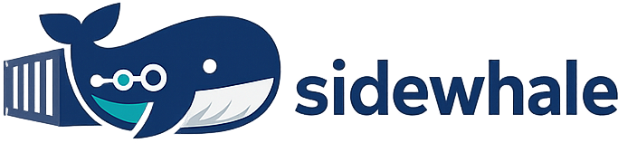

`sidewhale` is a small Docker API shim for Testcontainers execution in restricted environments.

Primary target: **Docker-on-Kubernetes style execution** via the `k8s` runtime backend (Sidewhale service creates worker Pods through the Kubernetes API).

It also supports a `host` runtime backend for sidecar-style usage where `proot` runs workloads locally in the Sidewhale process.

It is not a container runtime and does not try to be Docker-compatible beyond what Testcontainers needs.

## Status

Early project. No compatibility or stability guarantees.

Current focus:

- Kubernetes service runtime usage (`k8s` backend)
- Sidecar fallback usage (`host` backend)
- Testcontainers integration tests
- Simple and deterministic behavior

## What Works Right Now

- Basic Testcontainers lifecycle (`create`, `start`, `inspect`, `logs`, `stop`, `delete`)
- Unix socket listener (default: `<state-dir>/docker.sock`) for in-container Docker clients
- Image pulling and rootfs extraction
- Port publishing through TCP proxying
- Health and readiness probes (`/healthz`, `/readyz`)
- In-cluster sidecar run in k3d for PostgreSQL test (`DatabaseTest`) passed

## Known Gaps / Limitations

- No registry auth management beyond pass-through headers from clients
- Insecure registry configuration is not implemented as a runtime flag yet
- Oracle image currently fails under `proot` due missing syscall behavior
- Some clients may log noisy `Socket closed` traces when log-follow streams are closed
- No support for many Docker APIs (networks, volumes, build, exec/attach parity, etc.)
- Host backend only: no per-container network namespace or embedded DNS
- Cross-container name resolution (for example `broker-1` in multi-node stacks) is not supported
- Privileged internal bind ports (`<1024`) can fail for images that insist on binding as non-root
- Port publishing is best-effort TCP proxying, not Docker bridge/NAT semantics

## Docker API Support Matrix

Implemented:

- `GET /_ping`
- `GET /version`
- `GET /info`
- `POST /images/create`
- `GET /images/json`
- `GET /images/{name}/json` (returns 404 when not present)
- `POST /containers/create`
- `POST /containers/{id}/start`
- `POST /containers/{id}/stop`
- `POST /containers/{id}/kill`
- `DELETE /containers/{id}`
- `GET /containers/{id}/json`
- `GET /containers/{id}/logs`
- `GET /containers/{id}/stats`
- `POST /containers/{id}/wait`
- `GET /containers/{id}/archive`
- `PUT /containers/{id}/archive`

Partially implemented / best-effort:

- `POST /exec/{id}/start`
- `GET /exec/{id}/json`

Not implemented:

- Most other Docker endpoints return `404`.

## Local Smoke Run

```bash
docker build -t sidewhale:dev .
docker run --rm --network host sidewhale:dev --listen :23750 --listen-unix /tmp/sidewhale/docker.sock
```

Runtime backend flag:

- `--runtime-backend=host` (default, current implementation)
- `--runtime-backend=k8s` (in-cluster Pod execution backend, early implementation)
- `--k8s-runtime-namespace=<ns>` (optional worker Pod namespace override for k8s backend)
- `--k8s-image-pull-secrets=<name1,name2>` (optional imagePullSecrets for k8s worker Pods)
- `--k8s-cleanup-orphans=true|false` (default `true`, deletes labeled worker Pods not present in persisted state)

Then point Testcontainers (or any Docker API client) to:

```bash
DOCKER_HOST=tcp://127.0.0.1:23750

# Ryuk/inner clients can use:
# DOCKER_HOST=unix:///var/run/docker.sock
```

## Proxy + TLS Interception

Image pulls happen in the `sidewhale` process. Configure proxy and trust settings on the `sidewhale` container itself.

- Proxy env vars: `HTTPS_PROXY`, `HTTP_PROXY`, `NO_PROXY`
- Optional insecure mode for intercepted TLS: `--trust-insecure`

Quick smoke test (build image first):

```bash
make image VERSION=dev IMAGE_NAME=sidewhale
make smoke-pull IMAGE_NAME=sidewhale VERSION=dev \
  SIDEWHALE_RUN_ARGS="--trust-insecure" \
  SMOKE_IMAGE=redis:7-alpine
```

Example with proxy env vars:

```bash
HTTPS_PROXY=http://proxy.corp:8080 \
HTTP_PROXY=http://proxy.corp:8080 \
NO_PROXY=127.0.0.1,localhost \
make smoke-pull IMAGE_NAME=sidewhale VERSION=dev \
  SIDEWHALE_RUN_ARGS="--trust-insecure"
```

## In-Repo Testcontainers Smoke Tests

Run the Java smoke tests in `it/testcontainers-smoke` against a running Sidewhale endpoint:

```bash
export DOCKER_HOST=tcp://127.0.0.1:23750
make integration-test
```

By default this target sets `TESTCONTAINERS_RYUK_DISABLED=true`. Override if needed.

## Compatibility Matrix

For current host-backend compatibility status across Testcontainers modules, see:

- `docs/compatibility-matrix.md`

## Deployment Profiles

- `docs/deployment-profiles.md`
- `deploy/sidewhale-host-sidecar.yaml`
- `deploy/sidewhale-k8s-runtime.yaml`
- `deploy/sidewhale-k8s-runtime-nodeport.yaml` (dev only)
